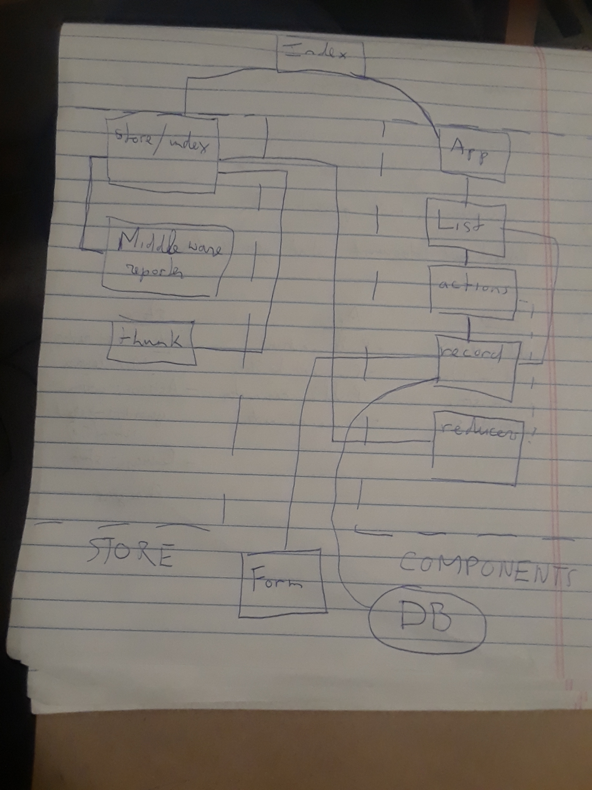

 LAB
=================================================

## Project Name
Lab 34: Remote Crud

### Author: Student
Trevor Stam

### Links and Resources
* [repo](https://codesandbox.io/s/myjr37wr4y)
* [back-end](https://javascript-401-api.herokuapp.com)

### Modules
#### `index.js`
Main

#### `App.js`
App,
`render()`

#### `List.js`
Records,
`deleteRecord`,
`editRecord`,
`reset`,
`render`,
`mapStateToProps`,
`mapDispatchToProps`,

#### `actions.js`
`postPlayers`,
`post`,
`destroy`,
`get`,
`patch`,
`put`,
#### `record.js`
Record,
Form,
`componentDidMount`,
`resetPlayer`,
`handleSubmit`,
`HandlePost`,
`HandlePut`,
`render`,
`mapStateToProps`,
`mapDispatchToProps`,
#### `reducers.js`
`reducers`,
#### `store/index.js`
`combineReducers`,
`createStore`,
`composeWithDevTools`,
`applyMiddleware`,

#### Tests
* How do you run tests?
* What assertions were made?
* What assertions need to be / should be made?

#### UML

